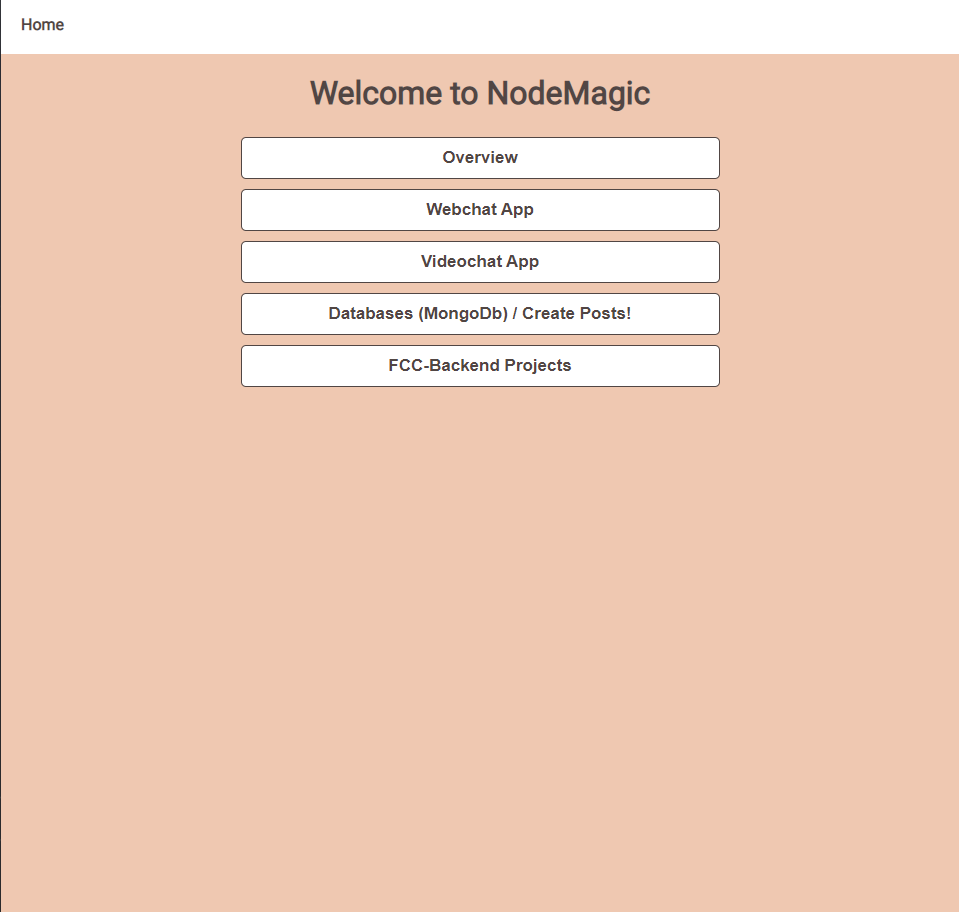

<br/>
<p align="center">
  <a href="https://github.com/ThatLukaszGuy/Nodemagic">
    
  </a>

  <h3 align="center">Nodemagic</h3>

  <p align="center">
    A little app showcasing of what is possible in an express/node app
    <br/>
    <br/>
    <a href="https://nodemagic.herokuapp.com/" target="_blank" rel="noopener">View Demo</a>
    .
  </p>
</p>

     

## Table Of Contents

- [Table Of Contents](#table-of-contents)
- [About The Project](#about-the-project)
- [Built With](#built-with)
- [Getting Started](#getting-started)
  - [Prerequisites](#prerequisites)
  - [Installation](#installation)
- [License](#license)
- [Authors](#authors)

## About The Project



This site is a little app build in node js on the express framework.

It shows on a very basic level many of the possibilities of what u can do in node js on the back end.
A lot of different technologies were used here: Node, Express and even Websockets and WebRTC


## Built With


<a href="https://www.w3.org/html/" target="_blank" rel="noreferrer">  </a><a href="https://www.w3schools.com/css/" target="_blank" rel="noreferrer">  </a><a href="https://developer.mozilla.org/en-US/docs/Web/JavaScript" target="_blank" rel="noreferrer">  </a>  <a href="https://getbootstrap.com" target="_blank" rel="noreferrer">  </a><a href="https://nodejs.org" target="_blank" rel="noreferrer">  </a> <a href="https://www.mongodb.com/" target="_blank" rel="noreferrer">  </a><a href="https://expressjs.com" target="_blank" rel="noreferrer">  </a>
<a href="https://ejs.co/"></a>


## Getting Started

To run this yourself you have to follow a couple of instructions

### Prerequisites

You will need a package manager (e.g: npm or yarn)

### Installation

1. Clone Repo

2. Clone the repo

3. Install NPM packages

    ```sh
     npm i
     ```

4. Create .env file

5. Create your own mongoDB atlas database

6. Import it in your project

7. Hide DB_USERNAME and DB_PASSWORD in env file along with the Port

8. Run it locally with ``` npm start```


## License

Distributed under the ISC License. 

## Authors

* ThatLukaszGuy


